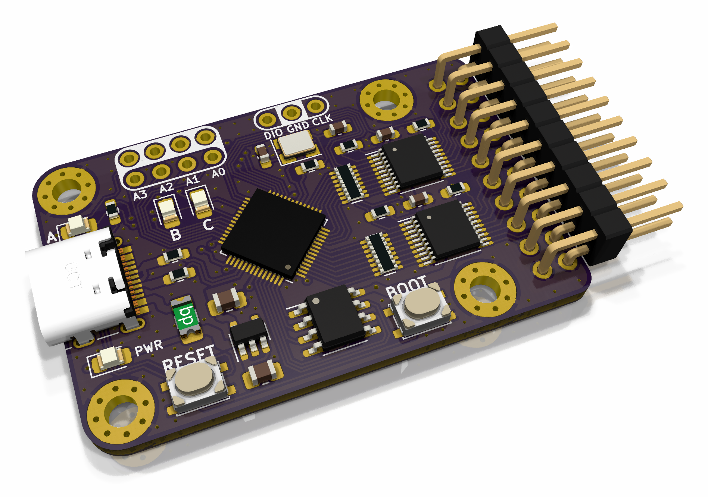

# jackrabbit

 

RP2040 16-channel 100 MHz logic analyzer

## Description
Jackrabbit is a RP2040-based 16-channel logic analyzer in a tiny 1.8" by 1.2" form factor. All digital inputs are buffered for compatibility with both 3V3 and 5V logic. Boot mode select and reset buttons are provided for convenience, and the ADC inputs and SWD pins are broken out. A USB-C connector is present for firmware updates and serial data.

## Documentation
- [Schematic](https://github.com/ElectronicToast/jackrabbit/blob/main/doc/jackrabbit.pdf)
- Fab print [front](https://github.com/ElectronicToast/jackrabbit/blob/main/doc/jackrabbit-f.pdf) and [back](https://github.com/ElectronicToast/jackrabbit/blob/main/doc/jackrabbit-b.pdf)
- [Interactive BOM](http://htmlpreview.github.io/?https://github.com/ElectronicToast/jackrabbit/blob/main/doc/ibom.html)

## Contributors
- Brian Cruz - BS EE, Caltech, 2023
- Brandon Gong - BS CECS, USC, 2024
- Ray Sun - BS EE, Caltech, 2020; PhD EE, USC, 2026

## Licensing
This project is released under the terms of the MIT License.
